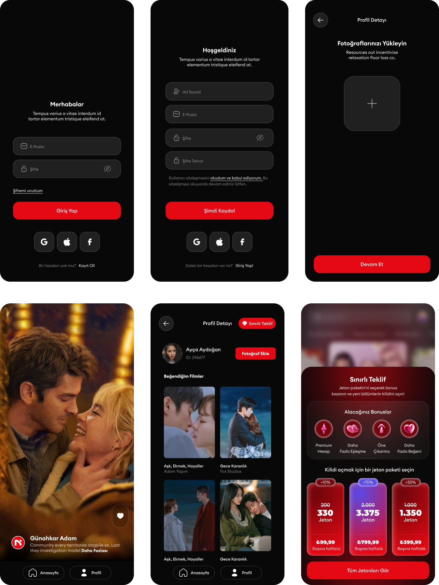

# ShartFlix

Bu proje, Nodelabs case projesi olarak figma tasarımları, swagger api endpointleri ve istenilen özelliklere göre tasarlanmış bir mobil uygulamadır.


## 🎥 Uygulama Tanıtım Videosu
 [Google Drive Tanıtım Videosu](https://drive.google.com/file/d/1GfkBuuJ9FV6TxyWh4B3xmawFH6lmt0hn/view?usp=sharing)

---



---

## 📂 Proje dosya yapısı

```bash
/frontend
│
├── lib
│   ├── main.dart
│   │
│   ├── model
│   │   ├── user
│   │   │   └── user_model.dart
│   │   └── movie
│   │       ├── movie_model.dart
│   │       ├── pagination.dart
│   │       └── data_model.dart
│   │
│   ├── services
│   │   ├── auth_services.dart
│   │   ├── movie_services.dart
│   │   └── photo_services.dart
│   │
│   ├── cubit
│   │   ├── add_photo
│   │   │   ├── add_photo_cubit.dart
│   │   │   └── add_photo_state.dart
│   │   ├── movie
│   │   │   ├── movie_cubit.dart
│   │   │   └── movie_state.dart
│   │   ├── favorite_movie
│   │   │   ├── favorite_movie_cubit.dart
│   │   │   └── favorite_movie_state.dart
│   │   ├── auth
│   │   │   ├── auth_cubit.dart
│   │   │   └── auth_state.dart
│   │   └── theme
│   │       └── theme_cubit.dart
│   │
│   ├── pages
│   │   ├── auth
│   │   │   ├── login_page.dart
│   │   │   └── signup_page.dart
│   │   ├── home
│   │   │   └── home_page.dart
│   │   ├── profil
│   │   │   └── profil_page.dart
│   │   ├── splash
│   │   │   └── splash_screen.dart
│   │   └── add_photo
│   │       └── add_photo_page.dart
│   │
│   ├── utils
│   ├── constants
│   ├── routes
│   ├── themes
│   └── widgets

```
---

## 🎯 Proje Amacı ve Kapsamı

- Flutter kullanarak kullanıcı dostu, modern bir film uygulaması arayüzü geliştirmek  
- Swagger dokümantasyonu üzerinden API endpoint'leriyle:
  - Kullanıcı girişi ve kayıt işlemleri  
  - Profil fotoğrafı ekleme  
  - Favori film ekleme ve listeleme  
  - Tüm filmleri listeleme gibi temel işlemleri gerçekleştirmek  
- JWT (JSON Web Token) ile kimlik doğrulama sağlamak  
- Film listesini **infinite scroll** (sonsuz kaydırma) özelliği ile dinamik olarak yüklemek 

---

## 🛠️ Teknolojiler 

| Katman | Teknoloji |
|--------|-----------|
| Frontend | Flutter |
| Kimlik Doğrulama | JWT |
| UI/UX Tasarım | Figma |
| State Management | Bloc/Cubit |
| Local veri tabanı | Shared preferenceres |

---

## 📱 Uygulama Senaryosu ve Özellikler

Kullanıcıların uygulama üzerinden gerçekleştirebileceği temel işlevler aşağıda listelenmiştir:

---

### 👤 1. Kullanıcı Yönetimi
- ✅ E-posta ve şifre ile kayıt olma  
- ✅ Mevcut kullanıcı ile giriş yapma  
- ✅ JWT Token kullanımı ile güvenli oturum yönetimi  

---

### 🚘 2. Film Sayfası
- 🔄 Anasayfada **infinite scroll** (sonsuz kaydırma) ile film listelenmesi  
- ❤️ State yönetimi ile animasyonlu beğeni işlemi  
- 🎬 Her filmin ismi ve açıklamasının gösterilmesi  
- 🔃 Modern tasarım ile **pull-to-refresh** desteği  

---

### 🧾 3. Profil Sayfası
- ⭐ Favori filmlerin görüntülenmesi  
- 📷 Profil fotoğrafı değiştirme  
- 🎁 Sınırlı teklif gösterimi için özel **bottom dialog** ekranı  

---

### ⚙️ 4. Genel İşlevler
- 🚀 Splash screen eklendi  
- 🎉 Kayıt olma işlemi başarılı olunca konfeti animasyonu  
- 🖼️ Uygulama logosu ve genel UI iyileştirmeleri
- 🔃 Tema değiştirme için yapı oluşturuldu renk kodları dosya üzerinde düzenlenerek kısa sürede gerçekleştirilebilir.

---

